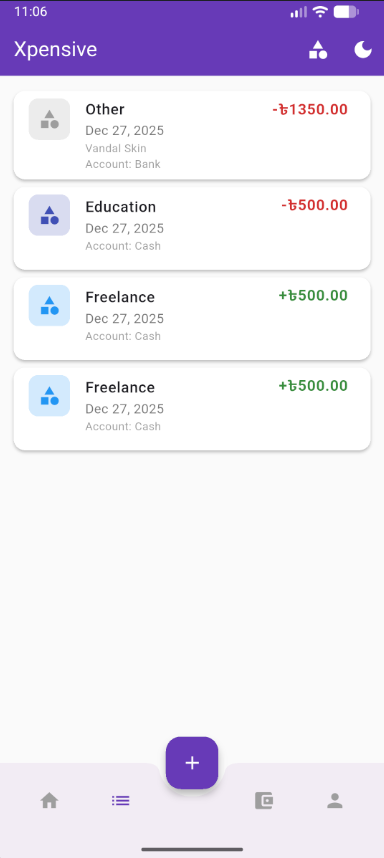

<div align="center">

# Xpensive

### Personal Expense Tracker

_A modern, cross-platform expense tracking application built with Flutter and Firebase._

[](https://flutter.dev)
[](https://dart.dev)
[](https://firebase.google.com)
[](LICENSE)

[Features](#features) • [Installation](#getting-started) • [Documentation](#project-structure) • [Contributing](#contributing)

</div>

---

## Table of Contents

- [Overview](#overview)
- [Features](#features)
- [Tech Stack](#tech-stack)
- [Getting Started](#getting-started)
- [Screenshots](#screenshots)
- [Project Structure](#project-structure)
- [Database Schema](#database-schema)
- [Contributing](#contributing)
- [License](#license)
- [Author](#author)

---

## Overview

**Xpensive** is a comprehensive personal finance management solution designed to help users take control of their financial life. Track income, monitor expenses, manage multiple accounts, and gain insights through interactive visualizations—all in one beautifully designed application.

### Why Xpensive?

- **Fast & Lightweight** - Built with Flutter for optimal performance
- **Cloud-Synced** - Your data is safely stored in Firebase
- **Cross-Platform** - Works on Web, Android, iOS, Windows, macOS, and Linux
- **Beautiful UI** - Modern Material Design 3 with dark mode support

---

## Features

<table>
<tr>
<td width="50%">

### Authentication

- Email & password registration/login
- Session persistence (stay logged in)
- Secure authentication via Firebase Auth

### User Profile

- Customizable profile with photo upload
- View account statistics
- Dark/Light mode toggle

### Account Management

- Create multiple accounts (Cash, Bank, Mobile Banking)
- Track balance per account
- Edit and delete accounts

</td>
<td width="50%">

### Category Management

- Pre-defined income & expense categories
- Create custom categories with icons and colors
- Organize transactions efficiently

### Transaction Tracking

- Record income and expenses
- Associate with accounts and categories
- Add notes/descriptions
- Automatic balance updates

### Statistics & Reports

- Visual pie charts for expense breakdown
- Total income vs expense summary
- Category-wise spending analysis

</td>
</tr>
</table>

---

## Tech Stack

<table>
<tr>
<td align="center" width="96">

<br><strong>Flutter</strong>
</td>
<td align="center" width="96">

<br><strong>Dart</strong>
</td>
<td align="center" width="96">

<br><strong>Firebase</strong>
</td>
<td align="center" width="96">

<br><strong>Material 3</strong>
</td>
</tr>
</table>

### Dependencies

| Package            | Version | Description             |
| ------------------ | ------- | ----------------------- |
| `firebase_core`    | ^3.8.1  | Firebase initialization |
| `cloud_firestore`  | ^5.6.0  | NoSQL cloud database    |
| `firebase_auth`    | ^5.3.4  | User authentication     |
| `firebase_storage` | ^12.4.0 | File storage            |
| `image_picker`     | ^1.1.2  | Image selection         |
| `fl_chart`         | ^0.69.2 | Interactive charts      |
| `intl`             | ^0.20.2 | Date formatting         |
| `uuid`             | ^4.5.1  | Unique ID generation    |

---

## Getting Started

### Prerequisites

Before you begin, ensure you have the following installed:

| Requirement  | Version                  |
| ------------ | ------------------------ |
| Flutter SDK  | 3.35.7+                  |
| Dart SDK     | 3.9.2+                   |
| Firebase CLI | Latest                   |
| IDE          | Android Studio / VS Code |

### Installation

<details>
<summary><b>1. Clone the Repository</b></summary>

```bash
git clone https://github.com/jerrysopro/xpensive-a-personal-budget-tracker.git
cd xpensive
```

</details>

<details>
<summary><b>2. Install Dependencies</b></summary>

```bash
flutter pub get
```

</details>

<details>
<summary><b>3. Configure Firebase</b></summary>

1. Create a project at [Firebase Console](https://console.firebase.google.com)
2. Enable **Authentication** (Email/Password provider)
3. Enable **Cloud Firestore**
4. Enable **Firebase Storage**
5. Run FlutterFire CLI:

```bash
dart pub global activate flutterfire_cli
flutterfire configure
```

</details>

<details>
<summary><b>4. Run the Application</b></summary>

```bash
# Web
flutter run -d chrome

# Android
flutter run -d android

# Windows
flutter run -d windows

# iOS (macOS only)
flutter run -d ios
```

</details>

---

## Screenshots

<div align="center">

|              Login              |                Dashboard                |             Add Transaction             |
| :-----------------------------: | :-------------------------------------: | :-------------------------------------: |
|  |  |  |

|               Accounts                |                Categories                 |              Statistics              |
| :-----------------------------------: | :---------------------------------------: | :----------------------------------: |
|  |  |  |

|               Profile               |             Dark Mode              |
| :---------------------------------: | :--------------------------------: |
|  |  |

</div>

---

## Project Structure

```
lib/
│
├── main.dart                    # Application entry point
├── firebase_options.dart        # Firebase configuration
│
├── models/                      # Data models
│   ├── user.dart                # User model
│   ├── account.dart             # Account model
│   ├── category.dart            # Category model
│   └── transaction.dart         # Transaction model
│
├── services/                    # Business logic
│   └── firebase_service.dart    # Firebase operations
│
├── providers/                   # State management
│   └── theme_provider.dart      # Theme management
│
└── screens/                     # UI screens
    ├── splash_screen.dart          # Splash/loading screen
    ├── login_screen.dart           # Login page
    ├── register_screen.dart        # Registration page
    ├── home_screen.dart            # Main dashboard
    ├── profile_screen.dart         # User profile
    ├── accounts_screen.dart        # Account management
    ├── categories_screen.dart      # Category management
    ├── add_transaction_screen.dart # Add transaction
    └── statistics_screen.dart      # Reports & charts
```

---

## Database Schema

### Entity Relationship

```
┌──────────────┐       ┌──────────────┐       ┌──────────────┐
│    Users     │       │   Accounts   │       │  Categories  │
├──────────────┤       ├──────────────┤       ├──────────────┤
│ id (PK)      │──┐    │ id (PK)      │       │ id (PK)      │
│ username     │  │    │ userId (FK)  │──┐    │ userId (FK)  │──┐
│ email        │  │    │ name         │  │    │ name         │  │
│ displayName  │  │    │ type         │  │    │ type         │  │
│ profilePhoto │  │    │ balance      │  │    │ icon         │  │
│ createdAt    │  │    │ currency     │  │    │ color        │  │
│ lastLogin    │  │    └──────────────┘  │    └──────────────┘  │
└──────────────┘  │                      │                      │
                  │    ┌──────────────┐  │                      │
                  │    │ Transactions │  │                      │
                  │    ├──────────────┤  │                      │
                  └───▶│ id (PK)      │  │                      │
                       │ userId (FK)  │◀─┘                      │
                       │ accountId(FK)│                         │
                       │ categoryId(FK)│◀───────────────────────┘
                       │ type         │
                       │ amount       │
                       │ date         │
                       │ note         │
                       └──────────────┘
```

<details>
<summary><b>Collection Details</b></summary>

#### Users Collection

| Field          | Type     | Description                |
| -------------- | -------- | -------------------------- |
| `id`           | String   | Primary key (Firebase UID) |
| `username`     | String   | Unique username            |
| `email`        | String   | User email address         |
| `displayName`  | String   | Display name               |
| `profilePhoto` | String   | Base64 encoded image       |
| `createdAt`    | DateTime | Registration timestamp     |
| `lastLogin`    | DateTime | Last login timestamp       |

#### Accounts Collection

| Field      | Type   | Description          |
| ---------- | ------ | -------------------- |
| `id`       | String | Primary key          |
| `userId`   | String | Foreign key (User)   |
| `name`     | String | Account name         |
| `type`     | String | cash / bank / mobile |
| `balance`  | Double | Current balance      |
| `currency` | String | Currency code (BDT)  |

#### Categories Collection

| Field    | Type   | Description        |
| -------- | ------ | ------------------ |
| `id`     | String | Primary key        |
| `userId` | String | Foreign key (User) |
| `name`   | String | Category name      |
| `type`   | String | income / expense   |
| `icon`   | String | Material icon name |
| `color`  | String | Hex color code     |

#### Transactions Collection

| Field        | Type     | Description            |
| ------------ | -------- | ---------------------- |
| `id`         | String   | Primary key            |
| `userId`     | String   | Foreign key (User)     |
| `accountId`  | String   | Foreign key (Account)  |
| `categoryId` | String   | Foreign key (Category) |
| `type`       | String   | income / expense       |
| `amount`     | Double   | Transaction amount     |
| `date`       | DateTime | Transaction date       |
| `note`       | String   | Optional description   |

</details>

---

## Contributing

Contributions are what make the open-source community amazing! Any contributions you make are **greatly appreciated**.

1. **Fork** the repository
2. **Create** your feature branch
   ```bash
   git checkout -b feature/AmazingFeature
   ```

````

3. **Commit** your changes
   ```bash
   git commit -m 'Add some AmazingFeature'
   ```
4. **Push** to the branch
   ```bash
   git push origin feature/AmazingFeature
   ```
5. **Open** a Pull Request

---

## License

This project is licensed under the **MIT License** - see the [LICENSE](LICENSE) file for details.

---

## Author

<div align="center">

**Rakib Rahman Rimon**

[](https://github.com/JerrySoPro)

</div>

---

## Acknowledgments

<div align="center">

Special thanks to these amazing projects:

[](https://flutter.dev/)
[](https://firebase.google.com/)
[](https://pub.dev/packages/fl_chart)

</div>

---

<div align="center">

**Star this repository if you found it helpful!**

Made with Flutter

</div>
````
