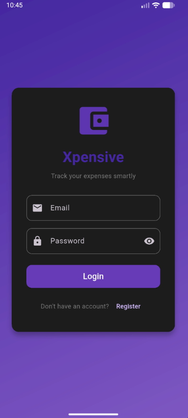
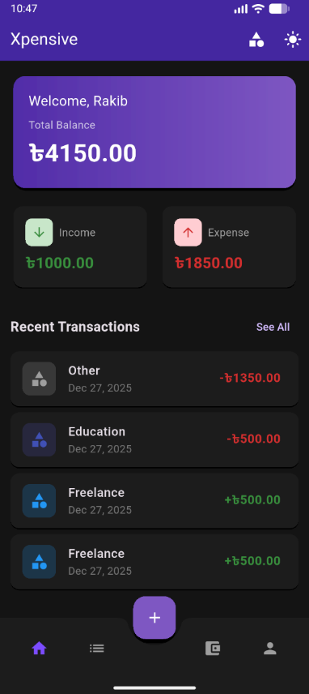
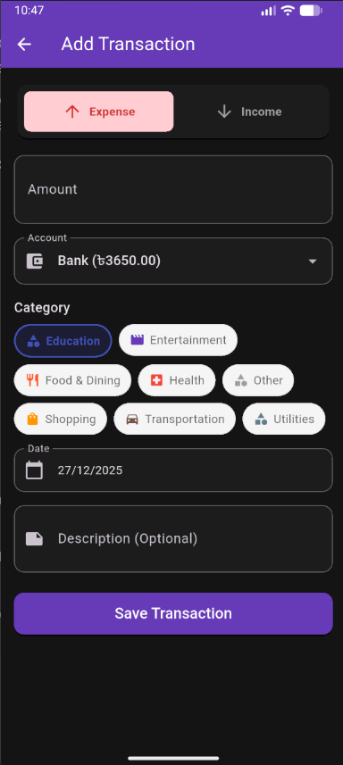
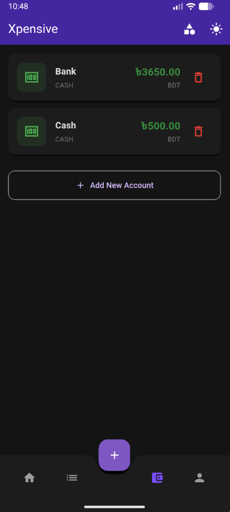
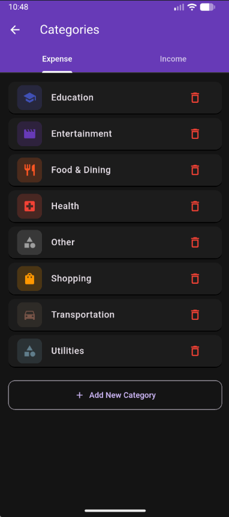
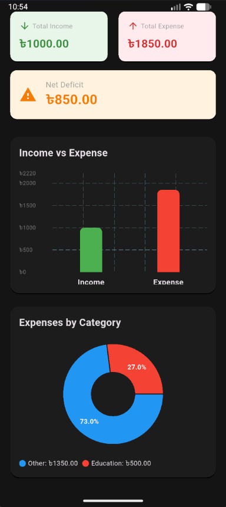
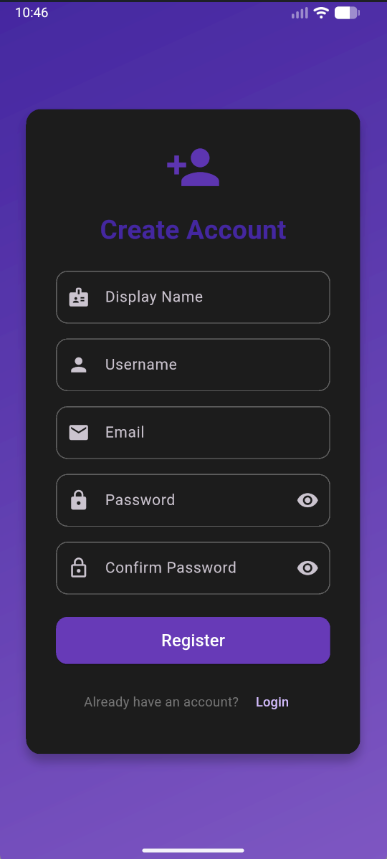

# 💰 Xpensive - Personal Expense Tracker

A modern, cross-platform expense tracking application built with Flutter and Firebase. Track your income, expenses, and manage your finances with ease.


## ✨ Features

### 🔐 Authentication

- Email & password registration/login
- Session persistence (stay logged in)
- Secure authentication via Firebase Auth

### 👤 User Profile

- Customizable profile with photo upload
- View account statistics
- Dark/Light mode toggle

### 💳 Account Management

- Create multiple accounts (Cash, Bank, Mobile Banking, etc.)
- Track balance per account
- Edit and delete accounts

### 📂 Category Management

- Pre-defined income & expense categories
- Create custom categories with icons and colors
- Organize transactions efficiently

### 💸 Transaction Tracking

- Record income and expenses
- Associate with accounts and categories
- Add notes/descriptions
- Automatic balance updates

### 📊 Statistics & Reports

- Visual pie chart for expense breakdown
- Total income vs expense summary
- Category-wise spending analysis

### 🎨 User Interface

- Material Design 3
- Dark mode support
- Responsive design
- Cross-platform (Web, Android, iOS, Windows, macOS, Linux)

## 🛠️ Tech Stack

| Technology        | Purpose                     |
| ----------------- | --------------------------- |
| Flutter           | Cross-platform UI framework |
| Dart              | Programming language        |
| Firebase Auth     | User authentication         |
| Cloud Firestore   | NoSQL cloud database        |
| Material Design 3 | UI components               |

## 📦 Dependencies

```yaml
dependencies:
  flutter: sdk
  firebase_core: ^3.8.1
  cloud_firestore: ^5.6.0
  firebase_auth: ^5.3.4
  image_picker: ^1.1.2
  fl_chart: ^0.65.0
  intl: ^0.18.1
  uuid: ^4.2.1
```

## 🚀 Getting Started

### Prerequisites

- Flutter SDK 3.35.7 or higher
- Dart SDK 3.9.2 or higher
- Firebase project configured
- Android Studio / VS Code with Flutter extensions

### Installation

1. **Clone the repository**

   ```bash
   git clone https://github.com/yourusername/xpensive.git
   cd xpensive
   ```

2. **Install dependencies**

   ```bash
   flutter pub get
   ```

3. **Configure Firebase**

   - Create a project at [Firebase Console](https://console.firebase.google.com)
   - Enable Authentication (Email/Password)
   - Enable Cloud Firestore
   - Run FlutterFire CLI:
     ```bash
     flutterfire configure
     ```

4. **Run the app**

   ```bash
   # Web
   flutter run -d chrome

   # Android
   flutter run -d android

   # Windows
   flutter run -d windows
   ```

## 📱 Screenshots

| Login                           | Dashboard                               | Add Transaction                         |
| ------------------------------- | --------------------------------------- | --------------------------------------- |
|  |  |  |

| Accounts                              | Categories                                | Statistics                           |
| ------------------------------------- | ----------------------------------------- | ------------------------------------ |
|  |  |  |

| Profile                             | Dark Mode                          |
| ----------------------------------- | ---------------------------------- |
|  |  |

## 📁 Project Structure

```
lib/
├── main.dart                 # App entry point
├── firebase_options.dart     # Firebase configuration
├── models/
│   ├── user.dart            # User model
│   ├── account.dart         # Account model
│   ├── category.dart        # Category model
│   └── transaction.dart     # Transaction model
├── services/
│   └── firebase_service.dart # Firebase operations
├── providers/
│   └── theme_provider.dart  # Theme management
└── screens/
    ├── splash_screen.dart   # Splash/loading screen
    ├── login_screen.dart    # Login page
    ├── register_screen.dart # Registration page
    ├── home_screen.dart     # Main dashboard
    ├── profile_screen.dart  # User profile
    ├── accounts_screen.dart # Account management
    ├── categories_screen.dart # Category management
    ├── add_transaction_screen.dart # Add transaction
    └── statistics_screen.dart # Reports & charts
```

## 🗄️ Database Schema

### Users Collection

| Field        | Type     | Description       |
| ------------ | -------- | ----------------- |
| id           | String   | Firebase UID      |
| username     | String   | Unique username   |
| email        | String   | User email        |
| displayName  | String   | Display name      |
| profilePhoto | String   | Base64 image      |
| createdAt    | DateTime | Registration date |
| lastLogin    | DateTime | Last login time   |

### Accounts Collection

| Field    | Type   | Description      |
| -------- | ------ | ---------------- |
| id       | String | Unique ID        |
| userId   | String | Owner's ID       |
| name     | String | Account name     |
| type     | String | cash/bank/mobile |
| balance  | Double | Current balance  |
| currency | String | BDT              |

### Categories Collection

| Field  | Type   | Description    |
| ------ | ------ | -------------- |
| id     | String | Unique ID      |
| userId | String | Owner's ID     |
| name   | String | Category name  |
| type   | String | income/expense |
| icon   | String | Icon name      |
| color  | String | Hex color      |

### Transactions Collection

| Field      | Type     | Description        |
| ---------- | -------- | ------------------ |
| id         | String   | Unique ID          |
| userId     | String   | Owner's ID         |
| accountId  | String   | Account reference  |
| categoryId | String   | Category reference |
| type       | String   | income/expense     |
| amount     | Double   | Transaction amount |
| date       | DateTime | Transaction date   |
| note       | String   | Optional note      |

## 🤝 Contributing

Contributions are welcome! Please feel free to submit a Pull Request.

1. Fork the project
2. Create your feature branch (`git checkout -b feature/AmazingFeature`)
3. Commit your changes (`git commit -m 'Add some AmazingFeature'`)
4. Push to the branch (`git push origin feature/AmazingFeature`)
5. Open a Pull Request

## 📄 License

This project is licensed under the MIT License - see the [LICENSE](LICENSE) file for details.

## 👨‍💻 Author

**Your Name**

- GitHub: [@yourusername](https://github.com/yourusername)

## 🙏 Acknowledgments

- [Flutter](https://flutter.dev/)
- [Firebase](https://firebase.google.com/)
- [FL Chart](https://pub.dev/packages/fl_chart)

---

<p align="center">Made with ❤️ using Flutter</p>
